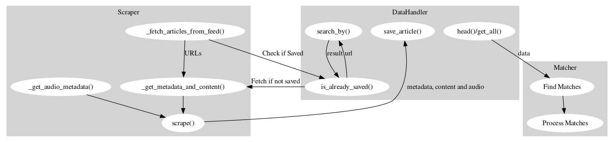
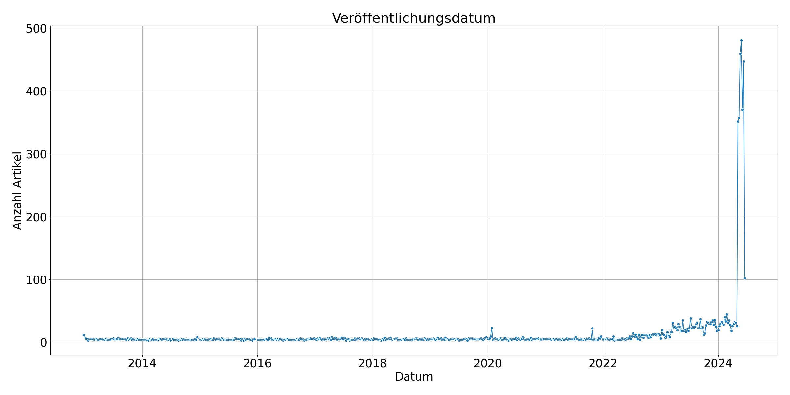
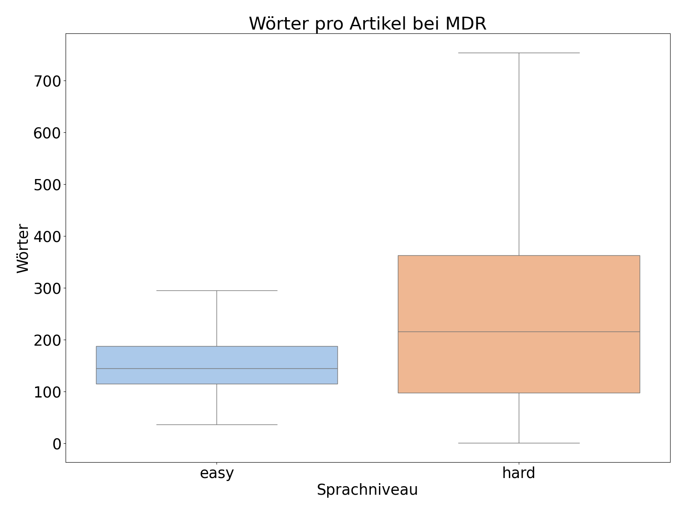

# KI-Projekt "Einfach Erklärt" Midterm Review
### KIP bei Herr Dr. Hußlein im SoSe 24

Lars Specht, Ben Reher, Simon Eiber und Felix Wippich, 26.06.24

1. Einleitung (Ben)
2. Allgemein
   1. Projektmanagement und organisatorische Herausforderungen (Felix)
   2. Überblick (alle)
   3. Kommunikation mit Nachrichtenquellen (Ben)
   4. Kommunikation mit anderer Gruppe 
3. Entwicklung
   1. Scraper (Lars)
   2. MDR Scraper (Lars)
   3. Deutschlandradio (Simon)
   4. Datenstruktur und Datahandler (Felix)
   5. Weitere Nachrichtenangebote (Simon)
   6. KI-Server (Ben)
   7. Technische Herausforderungen (Simon)
   8. Dokumentation zur Übergabe
4. Datenauswertung
   1. Gesamelte Daten
   2. Erkenntnisse über die Daten
5. Fazit (alle)


## 1. Einleitung

Die Umsetzung eines Projekts ist oft von technischen und organisatorischen Herausforderungen geprägt. In diesem Projektbericht werden sowohl technische als auch organisatorische Aspekte beleuchtet, die bisher bewältigt wurden. Darunter sind, die remote Durchführung von Meetings sowie die Kommunikation mit Nachrichtenquellen wie Deutschlandfunk (DLF), Nachrichtenleicht (NL) und Mitteldeutscher Rundfunk (MDR). Zudem wird die Datenstruktur für die Speicherung und das Scraping erläutert sowie ein Ausblick auf den Matching-Prozess gegeben, der für die Nutzung des aufgebauten Datensatzes von zentraler Bedeutung ist. Zuletzt geben wir einen kleinen Ausblick auf den weiteren Verlauf des Projekts.

## 2. Allgemein

### 2.1. Projektmanagement und organisatorische Herausforderungen

Neben technischen Herausforderungen in der Umsetzung des Projekts stellten sich auch einige zusätzliche organisatorische Herausforderungen.

Durch die nach dem Projektstart erfolgte Zuteilung eines Teammitglieds in das Team, war eine schnelle Kontaktaufnahme und Integration des neuen Teammitglieds notwendig. Dies erforderte eine schnelle Einarbeitung und Anpassung der Teamdynamik. In Folge sollten auch die wöchentlichen Meetings remote absolviert werden.

Trotz dieser zusätzlichen Schwierigkeiten wurden alle Herausforderungen bisher hervorragend bewältigt. Um die Ressourcen für alle Teammitglieder ständig bereitzuhalten, war bereits ein Repository auf GitHub angelegt, dieses wurde um eine Datei `Meetings.md` zur Protokollierung der in den remote Meetings besprochenen Inhalte erweitert. Die Meetings wurden fest wöchentlich und zusätzlich nach Bedarf angesetzt und finden virtuell über Zoom statt, des Weiteren ist ein ständiger Kommunikationskanal zum Austausch über WhatsApp, für kurzfristige Änderungen oder dringende Probleme, verfügbar. Neben der bekannten Herausforderung von Videokonferenzen, bietet Zoom die Chance, den Bildschirm für "Code-Reviews" und "Code-Vorstellungen" zu teilen.

### 2.2. Überblick



Die Abbildung 1 stellt den aktuellen Stand der Pipeline des Projekts dar. Unterteilt werden kann in die Scraper, den DataHandler und die Matcher, die alle miteinander interagieren. Die Scraper sammeln für die jeweilige Nachrichtenquelle Artikel, die der DataHandler dann in ein einheitliches Format bringt und mit ihrem Inhalt und den Metadaten speichert. Der Matcher vergleicht leichte und normale Artikel und versucht diese zu verbinden. Details zu den einzelnen Modulen finden sich in den jeweiligen Kapiteln.

## 3. Aktueller Stand 

### 3.1. Kommunikation mit Nachrichtenquellen

Die Kommunikation mit den Nachrichtenquellen wurde ein Bestandteil unseres Projekts. Wir wandten uns an DLF, NL und MDR, um Zugang zu ihren Nachrichteninhalten zu erhalten, da wir bereits bei DLF auf Schwierigkeiten beim Scrapen historischer Daten gestoßen sind und es als eine alternative Möglichkeit gesehen haben, dort direkt anzufragen. Es ist hier deutlich schwerer an die Daten zu kommen, da einerseits viel mehr publiziert wird im Vergleich zu NL und es keine einfach abrufbare API gibt. 
Über verschiedene Kanäle wie E-Mail, Instagram, TikTok und LinkedIn versuchten wir, Kontakt herzustellen. Nach mehreren Versuchen erhielten wir zuerst eine Antwort auf TikTok, dass es an das Team von NL weitergeleitet wurde. Einen Tag später kam dann eine Antwort von Herrn Bertolaso, einem leitenden Nachrichtenredakteur bei DLF. Er leitete unsere Anfrage weiter an Frau Gnad. Nach einem Telefonat mit ihr stellte sich heraus, dass noch die Möglichkeit besteht tagesaktuelle Daten aus den Instagram Captions von NL zu scrapen, was inzwischen Teil unserer Scraper geworden ist. Des Weiteren hat sie uns mit dem Archiv in Verbindung gesetzt. Wir haben dort einen direkten Ansprechpartner, da das Projekt nun aber schon abgeschlossen ist, kann dieser nur noch weiter für Herrn Baumann wichtig sein um in Zukunft an weitere Daten zu gelangen. 
Bei MDR entstand auch ein direkter Kontakt mit Patrick Herz, auch hier stellte sich heraus, dass ein direkter Zugang zu den Daten leider nicht möglich ist, da ihm leider keine Möglichkeit bekannt war uns da weiterzuhelfen. Wir haben uns hier nicht mehr an das Archiv gewendet, da eine weitere Anfrage zusammen mit einem bevorstehenden Email-Verkehr zu lange gedauert hätte. Vielen Dank an Herrn Herz für die schnelle und freundliche Antwort und MDR sowie das Übersetzungsbüro „Leicht ist klar“ für die Erlaubnis die Daten im Rahmen des Projekts zu verwenden.

Wir erwogen auch eine Zusammenarbeit mit der anderen Gruppe, die das gleiche Projekt durchführt, nachdem sich in einem Gespräch mit Prof. Baumann herausstellte, dass es sinnvoll sein könnte, sich beim Scrapen die Arbeit zu teilen. Jedoch wurde unsere Anfrage abgelehnt, da die andere Gruppe befürchtete, dass eine Auslagerung des Webscrapings zu einem Verlust in der Bewertung führen könnte, da dies ja auch Teil der Aufgabenstellung ist und auch einen gewissen Teil des Arbeitsaufwandes darstellt. Wir versuchten erneut nach den Midterm Reviews nach einem gemeinsamen Meeting mit Herrn Baumann in engere Zusammenarbeit mit der anderen Gruppe zu treten, um die Arbeit zu teilen, mehr Daten zu erlangen und mehr Ansätze für das Matching oder die Datenauswertung zu haben. Leider stellte sich heraus, dass die Gruppe nicht so zuverlässig in der Absprache war und wir uns deshalb entschieden, die Zusammenarbeit nicht weiterzuverfolgen und uns auf unsere eigenen Daten zu konzentrieren.

## 3.2 Scraper

### Was ist ein Scraper?

Ein Scraper ist ein Programm, das automatisch Daten von Webseiten extrahiert.
Es gibt verschiedene Arten von Scrapern, die sich in ihrer Funktionsweise und ihren Anwendungsmöglichkeiten unterscheiden.
In diesem Kontext werden zwei Scraper-Bibliotheken verwendet: BeautifulSoup und Selenium, die sich in ihren Funktionen und Anwendungsbereichen unterscheiden.

### BeautifulSoup

ist eine Bibliothek, die es ermöglicht, Daten aus HTML- und XML-Dateien zu extrahieren.
Sie kann jedoch keine Formulare bearbeiten oder JavaScript ausführen, weshalb sie nur für statische Webseiten geeignet ist.
Dies bedeutet, dass sie lediglich den HTML-Code der Webseite auslesen kann und nicht die dynamischen Inhalte, die durch JavaScript generiert werden, wie beispielsweise nach dem Drücken eines Buttons.

### Selenium

ist ein Webdriver, der es ermöglicht, Webseiten zu steuern und mit ihnen zu interagieren.
Ein Webdriver ist ein Programm, das die Steuerung eines Webbrowsers ermöglicht, indem es tatsächlich ein Browserfenster öffnet und dieses dann steuert.
Dieses Öffnen des Browserfensters kann auch im Hintergrund erfolgen, sodass der Nutzer nichts davon mitbekommt, was bedeutet, dass es auch ohne GUI auf einem Server (dem KI-Server) verwendet werden kann.
Selenium kann auch dynamische Webseiten auslesen, da es JavaScript ausführen kann.
Es ist jedoch langsamer als BeautifulSoup und benötigt mehr Rechenleistung, weshalb BeautifulSoup bevorzugt wird, wenn es möglich ist.

### 3.2.4 Arten von Scrapern

Für dieses Projekt werden zwei Arten von Scrapern benötigt:

#### Historische Scraper

sammeln die Artikel, die in der Vergangenheit auf den Webseiten veröffentlicht wurden.
Diese müssen nur einmalig ausgeführt werden, um die historischen Daten zu extrahieren.

#### Aktuelle Scraper

Aktuelle Scraper werden regelmäßig ausgeführt, um kontinuierlich die neuesten Artikel von den Webseiten zu extrahieren (z.B. einmal die Woche, immer wenn sich der Feed updated).

### 3.2.5 Der `BaseScraper`

Für die Scraper wurde eine Basisklasse `BaseScraper` erstellt, die allgemeine Funktionen und Methoden enthält, die für alle Scraper benötigt werden.
Die Basisklasse enthält die folgenden Methoden:

- `base_metadata_dict()`: Gibt ein Dictionary zurück, das die Metadaten enthält, die für jeden Artikel gespeichert werden sollen (zum Beispiel Titel, Beschreibung, Datum usw.).
- `_get_soup()`: Lädt die Webseite und gibt ein BeautifulSoup-Objekt zurück.
- `_fetch_articles_from_feed()`: Extrahiert die Artikel-URLs aus dem Feed (oder auf andere Weise, falls kein Feed verfügbar ist) der Webseite.
- `_get_metadata_and_content(url)`: Extrahiert die Metadaten und den Inhalt eines Artikels aus der URL.
- `scrape()`: Führt die einzelnen Schritte zum Scrapen der Webseite aus.

Dadurch müssen für jeden neuen Scraper nur noch die spezifischen Methoden implementiert werden, die für die jeweilige Webseite benötigt werden, was die Implementierung übersichtlicher macht.

## 3.3. MDR Scraper

### 3.3.1 Warum MDR?

Der MDR Scraper extrahiert Daten von der Webseite des Mitteldeutschen Rundfunks (MDR). Der MDR ist ein öffentlich-rechtlicher Rundfunksender, der für Sachsen, Sachsen-Anhalt und Thüringen Inhalte bereitstellt, darunter Nachrichten, Videos, Audios und mehr. Es gibt verschiedene Gründe, warum der MDR als Datenquelle gewählt wurde:

- Der MDR ist ein öffentlich-rechtlicher Sender, was eine gewisse Qualität der Daten sichert.
- Der MDR bietet eine Vielzahl von Inhalten.
- Das Angebot in einfacher Sprache des MDR und die normalen MDR-Nachrichten sind unter einem Dach, was bedeutet, dass es zu jedem leichten Artikel auch einen normalen Artikel gibt.
- Die leichten Artikel verlinken meist direkt den normalen Artikel, was die Notwendigkeit eines speziellen Matchers überflüssig macht.
- Der MDR bietet Audios an, die von Menschen eingesprochen wurden.
- Der MDR lädt wöchentlich eine große Anzahl leichter Artikel hoch, was eine gute Datenbasis bietet (ca. 22 Artikel pro Woche).

### 3.3.2 `MDRBaseScraper` - Funktionsweise

Der `MDRBaseScraper` wurde als Klasse geschaffen, um allgemeine Funktionen und Methoden zu enthalten, die sowohl für den aktuellen als auch den historischen MDR-Scraper benötigt werden.
Die Basisklasse enthält die folgenden Methoden:

- `_init_selenium()`: Initialisiert das Selenium-Webdriver-Objekt. Wird nur intern verwendet.
- `_try_audio_extraction()`: Versucht, das Audio des Artikels zu extrahieren. Wird von den `_get_metadata_and_content()`-Methoden der Klasse aufgerufen und nur intern verwendet.
- `_get_easy_article_metadata_and_content(url)`: Extrahiert die Metadaten und den Inhalt eines einfachen Artikels aus der URL. Wird von der `scrape()`-Methode aufgerufen und kann direkt an den `DataHandler` weitergegeben werden.
- `_get_hard_article_metadata_and_content(url)`: Das gleiche wie `_get_easy_article_metadata_and_content()`, aber für schwere Artikel. Die Website-Struktur der schweren Artikel unterscheidet sich von der der einfachen Artikel, daher wird eine separate Methode benötigt.

Die `_get_article_and_metadata_...`-Methoden wurden möglichst robust gebaut, um auch bei Änderungen in der Website-Struktur weiterhin funktionieren zu können.
Hierfür wurden verschiedene Methoden ausprobiert, um an die benötigten Daten zu gelangen.
Die Methoden, die am besten funktionierten, wurden dann in die Methoden der Klasse integriert.
Zudem fehlen immer wieder Teile der benötigten Metadaten auf der Website.
Das hat immer wieder zu Problemen geführt, auch in Kombination mit dem `DataHandler`, da dieser teilweise auf die Metadaten angewiesen ist, um die Artikel zu speichern.
Es mussten immer wieder Workarounds gefunden werden, um die fehlenden Metadaten zu ersetzen, meistens durch Platzhalter.

### 3.3.3 MDR: Aktueller Scraper - Funktionsweise

Der aktuelle MDR Scraper extrahiert zunächst die Links der Artikel vom Angebot in einfacher Sprache des MDR und lädt die einfachen Artikel mitsamt Audio, Metadaten, dem rohen HTML-Code und dem extrahierten Inhalt herunter.
An die Audios zu gelangen ist nicht ganz einfach, da der MDR die Audios nicht direkt verlinkt, sondern sie über eine JavaScript-Datei lädt.
Daher muss hier Selenium verwendet werden.
Da die einfachen Artikel häufig auf die normalen Artikel verlinken, wird hierfür kein spezieller Matcher benötigt.
Die Matches werden hierbei direkt über den `SimpleMatcher` eingetragen.
Im Anschluss an den einfachen Artikel wird jeweils der schwere Artikel gescraped.
Ist kein schwerer Artikel auf einen einfachen Artikel verlinkt, wird nur der einfache Artikel gescraped.

### 3.3.4 MDR: Historischer Scraper - Funktionsweise

Der historische MDR Scraper gestaltet sich etwas komplizierter, da der MDR keine direkte Möglichkeit bietet, auf ein (großes) Archiv an Artikeln zuzugreifen.
Dennoch gibt es eine große Menge alter Artikel, die noch auf der Webseite verfügbar sind.
Auf verschiedene Weisen wurden zunächst die Links alter einfacher Artikel gesammelt und in einer Liste gespeichert.
Nachdem keine weiteren Methoden zur Erweiterung dieser Link-Liste gefunden wurden, wurden die einfachen Artikel und die dort verlinkten schweren Artikel gescraped.
Hier sind die Methoden, die ausprobiert wurden, um an die Links alter einfacher Artikel des MDR zu gelangen:

#### Methode 1: Eigene MDR-Suche (nicht erfolgreich)

Die erste Methode war die Verwendung der inoffiziellen MDR-Such-API, um nach alten Artikeln zu suchen.
Nach einigen Experimenten mit der Entwicklerkonsole des Browsers wurde diese API gefunden.
Es stellte sich jedoch heraus, dass die MDR-Suche nicht sehr zuverlässig ist und insgesamt nur wenige Artikel gefunden werden konnten.

#### Methode 2: Google-Suche (erfolgreich)

Mit `serpapi.com` konnte eine Möglichkeit gefunden werden, Google-Suchergebnisse zu extrahieren.
Folgende Suchanfrage stellte sich als am effizientesten heraus: `site:mdr.de intext:"Hier können Sie diese Nachricht auch in schwerer Sprache lesen:"`.
Diese Suchanfrage lieferte die Links zu den alten einfachen Artikeln, da in jedem einfachen Artikel vom MDR, der eine Verlinkung zu einem schweren Artikel enthält, dieser Text vorhanden ist.
Damit haben alle diese Links automatisch auch einen verlinkten schweren Artikel.
Da der `SerpAPI` jedoch sehr limitiert ist (100 kostenlose Suchanfragen pro Monat), konnten nur etwa 330 alte einfache Artikel gesammelt werden.
Zudem kann bei Google nur auf die ersten ca. 300-400 Suchergebnisse zugegriffen werden, was die Anzahl der gefundenen Artikel weiter einschränkt.

#### Methode 3: Bing API (erfolgreich)

Nach weiterem Suchen wurde eine kostenlose Bing API gefunden, die es ermöglichte, Suchergebnisse von Bing zu extrahieren.
Diese API ist nicht so limitiert wie die `SerpAPI` Google API und bot mehr Konfigurationsmöglichkeiten.
Außerdem stehen bei der Bing API pro Monat 1000 kostenlose Suchanfragen zur Verfügung.
Durch verschiedene Variationen der Suchanfragen (z.B. verschiedene Datumsbereiche, verschiedene Suchbegriffe) konnten hiermit etwa 230 zusätzliche alte einfache Artikel gesammelt werden.

## 3.4 Deutschlandradio

Deutschlandradio ist ein Bestandteil des öffentlich-rechtlichen Rundfunks und verantwortlich für die Produktion verschiedener Nachrichtenangebote, darunter DLF und NL, die als bedeutende Datenquellen dienen.
Eigenständige Redaktionen sind dafür zuständig, die jeweiligen Inhalte zu konzipieren und zu veröffentlichen.

Die Gründe für die Berücksichtigung von Deutschlandradio sind divers:

- Es ist Teil des öffentlich-rechtlichen Rundfunks.
- Die Reichweite erstreckt sich über ganz Deutschland.
- Es bietet eine breite inhaltliche Abdeckung aktueller Themen, darunter Politik, Wirtschaft, Wissenschaft, Gesellschaft und Kultur.
- Es besteht eine redaktionelle Nähe zwischen DLF und NL.
- Die Inhalte werden von eigenständigen Redaktionen erstellt, in Form von Artikeln und Audios.

#### Nachrichtenleicht

Auf der Internetseite von NL werden jeden Freitagnachmittag etwa fünf bis sechs Artikel in leicht verständlicher Sprache veröffentlicht. Zusätzlich werden die Artikel häufig als Audio angeboten, die von menschlichen Sprechern eingesprochen werden.

#### Scraping

Dank der redaktionellen Nähe zwischen DLF und NL sind die Internetseiten größtenteils strukturell identisch aufgebaut. Dadurch konnte ein `DeutschlandradioScraper` basierend auf dem BaseScraper entwickelt werden, um Redundanzen zu vermeiden. Die Unterschiede liegen hauptsächlich in den Metadaten und der Verfügbarkeit von Audio bei NL-Artikeln. Ausgehend vom `DeutschlandradioScraper` konnten entsprechende Scraper für DLF und NL abgeleitet werden. Für den NL-Feed wurde eine API-Schnittstelle gefunden, die das Scrapen erleichtert.

## 3.5. Datenstruktur 
Auf Anraten von Professor Baumann wird für die Speicherung keine SQL-Datenbank benutzt, sondern wie in der Abbildung dargestellt eine Ordnerstruktur.

```
|-- data
|   |-- DLF
|   |   |-- easy
|   |   |   |-- 2024-03-15-Bundes-Wehr_beteiligt_sich_an_[...]
|   |   |   |   |-- audio.mp3
|   |   |   |   |-- content.txt
|   |   |   |   |-- metadata.json
|   |   |   |   |-- raw.html
|   |   |   |-- lookup_DLF_easy.csv
|   |   |-- hard
|   |   |   |-- 2024-04-25-Angebliche_Drohnenangriffe_[...]
|   |   |   |   |-- content.txt
|   |   |   |   |-- metadata.json
|   |   |   |   |-- raw.html
|   |   |   |-- lookup_DLF_hard.csv
|   |   |-- matches_DLF.csv
```
_Figure 2: Struktur des zur Speicherung genutzten Dateisystems am Beispiel von DLF (hard) und NL (easy) (reduziert auf jeweils einen Artikel)_

Für jede Nachrichtenquelle findet sich im `data` Verzeichnis ein Unterordner. Da das Matchen lediglich innerhalb derselben Quelle (also z.B. nur DLF zu NL, nicht DLF zu MDR) stattfinden soll, findet sich die Datei mit den jeweiligen Matches (`matches_<Nachrichtenquelle>.csv`) auf dieser Ebene (z.B. DLF). Jedes der Unterverzeichnisse ist wiederrum aufgeteilt in die Ordner `easy` und `hard`, wobei easy die Nachrichten in leichter Sprache enthält und hard die Nachrichten in Standardsprache. Hier findet sich für jeden gespeicherten Artikel ein eigener Ordner mit der Benennungsstruktur `<Jahr>-<Monat>-<Tag>_<Titel>`. Im Ordner zum jeweiligen Artikel findet sich jeweils `content.txt`, der Haupttext des Artikels, `metadata.json`, der Verschiedene Metadaten wie URL, Autor und Datum in einem über alle Nachrichtenquellen standardisierten JSON-Format enthält, sowie `audio.mp3`, falls der Artikel als vorgelesene Version als Audio verfügbar ist.
 
Für eine effiziente Suche der Artikel nach ihren jeweiligen Links ist jeweils eine sogenannte `lookup-<Nachrichtenquelle>-<easy|hard>.csv` implementiert. In diesem wird für jeden gespeicherten Artikel jeweils der Dateipfad und der Link im CSV-Format abgespeichert. Die URL des Artikels wird auch in den Metadaten gespeichert, dennoch entstand die Idee des redundanten Speicherns um für die Suche nach der URL nicht über das ganze Verzeichnis iterieren, sondern lediglich eine CSV-Datei analysieren zu müssen. Besonders bei großen Datenmengen ist so eine bessere Effizienz erhofft.  Es ist zu erwarten, dass dieser Unterschied bei größeren Datenmengen noch deutlicher wird.

```python
'''Getestet wurde die Suche über den Link des Artikels 
sowie den Titel. Die Funktion sucht bei der url automatisch 
im Lookuptable ansonsten iteriert sie über das Unterverzeichnis. 
Das erste Argument e steht dafür, dass das easy Unterverzeichnis 
durchsucht werden soll''' 
dh.search_by("e", "url", "https://www.DLF.de/ \
zahl-der-arbeitslosen-sinkt-im-april-um-20-102.html")
dh.search_by("e", "title", "Zahl der Arbeitslosen sinkt \
im April um 20.000")
# Output
"Time taken for search_by url: 0.0020 seconds"
"Time taken for search_by title: 0.0071 seconds"
```

Die Speicherung im eigenen Format bietet viel Flexibilität und Unabhängigkeit von Versionen eines Datenbankmanagementsystems. Allerdings stellt sich die Herausforderung eines komfortablen, einheitlichen und effizienten Zugriffs auf die Daten. 

##### Der `DataHandler`

übernimt diese Rolle. Er bietet ein Interface für den **Zugriff** auf die Daten durch Funktionen wie `head`, welcher die ersten n Artikel als Pandas DataFrame zurückgibt. Des Weiteren soll eine einheitliche **Speicherung** durch vordefinierte Speicherfunktionen sichergestellt werden. Auch ermöglicht der DataHandler eine **Suche** im Verzeichnis nach Metadaten. Um keine Artikel doppelt zu Scrapen gibt es außerdem die Funktion `is_already_saved`, welche sich die bessere Sucheffizienz der Lookuptable zunutze macht. Sie gibt zurück, ob die URL bereits gescraped und gesaved wurde. Das DataHandler Objekt muss mit der jeweiligen Nachrichtenquelle initialisiert werden (aktuell `“dlf“`, oder `“mdr“`) und kann dann für das jeweilige Unterverzeichnis genutzt werden. Die Initialisierung mit der Nachrichtenquelle soll unter anderem einer Vermischung der Daten vorbeugen. Den meisten Funktionen muss übergeben werden, ob im `“hard“` (`“h“`), oder `“easy“` (`“e“`) Unterverzeichnis gelesen oder geschrieben werden soll.

##### Entwicklung und Debugging 

Als zentrales Modul für die Speicherung und den Zugriff auf die Daten war es wichtig sicherzustellen, dass der DataHandler zuverlässig und effizient arbeitet. Viele Features wurden von Anfang an (per design) angelegt, um die Effizienz des DataHandlers zu optimieren und direkt die meisten Funktionen bereit zu stellen. Dazu gehörte zum Beispiel der Lookup Table, um eine effiziente Suche zu ermöglichen. Durch die Zentralität des Moduls und die Schwierigkeit das Modul zu testen ohne, dass größere Datenmengen verfügbar waren, entwickelte sich die Robustheit des Moduls mit der Entwicklung der der anderen Module, in denen er Anwendung fand. Hier wurden des Öfteren Issues zurückgemeldet, die gefixt werden mussten. Da der DataHandler mit dem Dateisystem arbeitet und unter Windows 11 entwickelt wurde, traten im Verlauf vor allem Fehler auf, die auf den Unterschied zwischen Linux und Windows zurückzuführen waren. Diese konnten behoben werden, indem die Pfade in den Funktionen angepasst wurden. Ziel ist es, dass der DataHandler sowohl auf Windows als auch auf Linux lauffähig ist. Auch einige kleinere Erweiterungen wurden vorgenommen, um weitere Funktionen bereit zu stellen, beispielsweise das Abrufen der Audios. Im Laufe der Entwicklung fand außerdem ein großes Refactoring statt, um den Code übersichtlicher und wartbarer zu machen. Hierfür wurden alle Funktionen die nicht direkt als Interface für den Nutzer gedacht waren, in eine eigene Klasse `DataHandlerHelper` ausgelagert.

##### Examples 

Da der Datahandler, wie das gesamte Projekt so angelegt ist, der er zur Weiterentwicklung und Forschung dienen kann, wurden ein Notebook mit Beispielen erstellt indem die Funktionen des DataHandlers demonstriert werden. Ein Weiterer Fokus lag, in der ausführlichen Dokumentation der Klasse und Funktionen durch Python Docstrings. 


## 3.6 Weitere Nachrichtenangebote

Zur Auswahl standen auch die Nachrichtenangebote der APA (Austria Presse Agentur), des NDR und des SR. Die APA bietet Nachrichten in leichter Sprache an, die von capito.ai generiert werden, einem vollautomatisierten KI-Tool zur Übersetzung von Texten aus der Standardsprache in leicht verständliche Sprache. Auf ihrer Webseite sind die Originalartikel sowie Übersetzungen in die Sprachniveaus B1 und A2 verfügbar. Wir haben uns gegen die Verwendung der APA als Datenquelle entschieden, da keine Audioversionen der Artikel vorhanden sind und die Artikel in leichter Sprache ausschließlich von KI generiert werden, was zu einem möglichen Bias in den Daten führen könnte. Darüber hinaus erreichen die Artikel nicht die qualitativen Standards der öffentlich-rechtlichen Sender. Sowohl der NDR als auch der SR sind Mitglieder des öffentlich-rechtlichen Rundfunkverbunds ARD und bieten ebenfalls Nachrichten in leichter Sprache mit Audio an. Allerdings unterscheiden sich die Texte in leichter Sprache formell stark von denen des Deutschlandradios und des MDR. Zudem gibt es keinen separaten Nachrichtenfeed, was das Scrapen der Artikel erschwert. Das Angebot des SR in leichter Sprache konzentriert sich hauptsächlich auf regionale Nachrichten aus dem Saarland. Aus diesen Gründen haben wir vorläufig beschlossen, diese Nachrichtenangebote nicht zu berücksichtigen.

### 3.7. KI-Server

Die Datenspeicherung und das Scraping (später auch das Matching der Artikel) finden über den KI-Server der OTH statt. Dies war von Anfang an die Idee, da dieser eine hohe Rechenleistung bietet und somit das Scraping und unsere kommenden Schritte schneller und effizienter gestaltet. Seit kurzem existiert auch die Ordnerstruktur und die Daten werden automatisiert gespeichert. 

Mithilfe eines Cronjobs werden die Scraping-Skripte regelmäßig ausgeführt, um die neuesten Artikel zu speichern. Wie bereits erwähnt, veröffentlicht NL wöchentlich neue Artikel und DLF, sowie MDR, täglich. Demnach wird es zwei Skripte geben. Eines, das einmal am Tag ausgeführt wird und die neuen Artikel von NL speichert und eines, das alle zwei Stunden ausgeführt wird und die neuen Artikel von DLF und MDR speichert oder aktualisiert. Sollten wir mit diesen noch experimentellen Zeiträumen für die Ausführung der Skripte auf Probleme stoßen, werden wir diese gerade am Anfang der Scraping-Phase natürlich auch noch anpassen.

## 3.8. Technische Herausforderungen

#### Scraper

Webseiten werden kontinuierlich aktualisiert und verbessert, was zu Änderungen in der HTML-Struktur und den CSS-Klassen führen kann, die für das Scraping verwendet werden. Diese Änderungen können dazu führen, dass die Scraping-Skripte nicht mehr ordnungsgemäß funktionieren, da sie nicht mehr in der Lage sind, die benötigten Informationen korrekt zu extrahieren. Dies erfordert eine regelmäßige Überwachung der Webseite sowie eine kontinuierliche Aktualisierung der Scraping-Skripte, um sicherzustellen, dass sie weiterhin effektiv arbeiten.

#### Skalierbarkeit

Bei der Verarbeitung großer Datenmengen, wie beispielsweise beim Matching, kann die Leistung des DataHandlers stark beeinträchtigt werden. Im Gegensatz zu eigenständigen Datenbanksystemen ist er nicht speziell für die Bewältigung solcher Datenmengen optimiert. Dies kann zu längeren Verarbeitungszeiten, erhöhtem Ressourcenverbrauch und potenziell anderen unbekannten Problemen führen. Eine der Hauptlimitationen liegt in der Ordnerstruktur der Daten, da bei Operationen auf den Daten alle Ordner der Artikel durchlaufen werden müssen.

Es ist daher entscheidend, den DataHandler gegebenenfalls entsprechend zu optimieren. Dies kann durch verschiedene Maßnahmen erfolgen, darunter Parallelisierung, Optimierung der Datenstrukturen oder die Nutzung eines dedizierten Datenbanksystems. Durch diese Optimierungen kann die Leistungsfähigkeit des DataHandlers verbessert und die Effizienz bei der Verarbeitung großer Datenmengen gesteigert werden.

#### Historische Artikel

Das Scrapen historischer Artikel birgt seine eigenen Herausforderungen, insbesondere in Bezug auf die Zugänglichkeit und Verfügbarkeit der URLs zu den Artikeln sowohl beim DLF als auch beim MDR. Zusätzlich dazu besteht die Schwierigkeit, die Konsistenz der gesammelten Daten sicherzustellen, da Artikel nur einmal gescraped werden und zukünftige Änderungen der Redaktionen an den Artikeln nicht überprüft und aktualisiert werden. Eine effektive Lösung hierfür könnte eine Funktionalität im DataHandler sein, die nicht nur das Datum des Scrapings berücksichtigt, sondern auch eine Versionierung der Artikel implementiert. Dadurch ließe sich diese Problematik beheben, da verschiedene Versionen eines Artikels zur Verfügung stehen und Änderungen der Redaktionen verfolgt werden könnten.

### 3.8. Matcher

Matcher sind toll. #FIXME: (mit matches.csv erklärt!)

#### Der `BaseMatcher`

ist die Basis-Klasse aller Matcher.
Sie stellt vor allem sicher, dass der richtige Pfad verwendet wird und bietet mit der Funktion `write_match` die Möglichkeit, Matches in jeweils `mdr_matches.csv` und `dlf_matches.csv` zu schreiben.

#### Der `SimpleMatcher`

ist eine Klasse die auf dem `BaseMatcher` aufbaut und vor allem von den MDR-Scrapern verwendet wird, da beim MDR die leichten auf die schweren Artikel verweisen.
Mit der Funktion `match_by_url` bietet er die Möglichkeit, Matches mithilfe von URLs des einfachen und schweren Artikels in die jeweilige Datei zu schreiben.

### 3.9. Matching mit Tf-idf

Das Matching von Artikeln dient dazu, Texte in einfacher Sprache mit ihren äquivalenten in normaler Sprache zu verknüpfen. Das Verfahren nutzt statistische Textanalyse und Informationsretrieval-Techniken wie das Tf-idf-Maß und Cosine-Similarity, um die inhaltliche Übereinstimmung zwischen Texten zu bewerten.
Der Prozess umfasst folgende Schritte:

1. Vektorisierung des Artikels
2. Transformation in die Tf-idf Darstellung
3. Vergleich der Artikel-Vektoren mit Cosine-Similarity
4. Evaluation des Matchers mit zusätzlichen Kriterien

#### 3.9.1. ArticleVectorizer

Die Klasse `ArticleVectorizer` implementiert eine Textvektorisierungsfunktion, die speziell für die Verarbeitung von Texten in einfacher Sprache entwickelt wurde. 
Die Klasse implementiert anwendungsspezifische Funktionen und dient dazu Texte zu verarbeiten und sie in ein Format zu transformieren, das für maschinelles Lernen verwendet werden kann.
Sie verwendet die Natural Language Toolkit (NLTK) Bibliothek zur Tokenisierung und Entfernung von Stoppwörtern im Deutschen.

##### Funktionsweise

1. **Tokenisierung und Bereinigung:** Die Methode `generate_tokens` zerlegt einen Text in einzelne Tokens und bereinigt diese. Dies beinhaltet das Entfernen von Stoppwörtern, Nicht-Alphanumeric-Zeichen und die mögliche Konvertierung segmentierter Wörter (z.B. "Fußball-Spiel" zu "Fußballspiel").

2. **Generierung von n-Grammen:** Die Methode `generate_ngrams` erstellt aus den Tokens n-Gramme unterschiedlicher Längen. Diese n-Gramme sind Kombinationen aufeinanderfolgender Tokens, die als eine Einheit betrachtet werden, um kontextuelle Informationen zu bewahren. Optional werden hierbei nur n-Gramme berücksichtigt, die mindestens ein Substantiv oder Nomen (großgeschriebenes Wort) enthalten. Die Umwandlung in Kleinbuchstaben erfolgt am Ende der n-Gram generierung. 

3. **Analysefunktion:** Die `analyzer`-Methode kombiniert die Schritte der Tokenisierung und n-Gramm-Erstellung.

4. **CountVectorizer Integration:** Der `ArticleVectorizer` nutzt intern den `CountVectorizer`aus `sklearn.feature_extraction.text` zur Vektorisierung der vorverarbeiteten Artikel. Dieser wird mit den konfigurierten Parametern initialisiert und verwendet die `ArticleVectorizer.analyzer`-Methode.

5. **Integration in die Pipeline:** Die `fit`- und `transform`-Methoden ermöglichen die Integration der Vektorisierungsfunktion in die Scikit-Learn-Pipeline. `fit` lernt das Vokabular aus den Trainingsdaten, während `transform` die Artikel in eine Häufigkeitsmatrix umwandelt.

##### Helferfunktionen

Zusätzliche Hilfsfunktionen wie `get_ngrams_with_capitalized`, `is_segmented_word` und `convert_segmented_word` unterstützen spezifische Bereinigungs- und Transformationsschritte, um die Präzision und Flexibilität des Vektorisierungsprozesses zu erhöhen, indem sie spezifische sprachliche oder strukturelle Eigenschaften der Textdaten und leichten Sprache berücksichtigen.

#### 3.9.2. Matcher

##### TF-IDF und TfidfTransformer

TF-IDF ist eine statistische Methode, die dazu dient die Bedeutung eines Wortes in einem Dokument relativ zu einer Sammlung von Dokumenten (Korpus) zu bewerten.

- **Term Frequency (TF):** Maß für die Häufigkeit eines Begriffs in einem Dokument.
- **Inverse Document Frequency (IDF):** Maß für die Wichtigkeit eines Begriffs in einem Korpus.

Das Produkt aus TF und IDF ergibt den TF-IDF-Wert eines Begriffs in einem Dokument. Ein hoher TF-IDF-Wert deutet darauf hin, dass der Begriff für das spezifische Dokument wichtig ist, aber in der gesamten Dokumentensammlung eher selten vorkommt.
Der `TfidfTransformer` aus der `scikit-learn` Bibliothek realisiert diese Transformation.

##### Pipeline 

Die Häufigkeitsmatrix des `ArticleVectorizer` wird durch den `TfidfTransformer` in eine Tf-idf-Matrix überführt. Diese dient zur Berechnung der Ähnlichkeit zwischen Texten (bzw. Artikeln in leichter und normaler Sprache) mittels Cosine-Similarity. 
Das Artikel-Paar mit der größten Kosinus-Ähnlichkeit wird als Match identifiziert.

#### 3.9.3 Ausblick

Der aktuelle Stand erlaubt die Definition eines Matchers, der das Preprocessing und die Vektorisierung durch den `ArticleVectorizer` sowie das Matching zwischen leichten und normalen Artikeln automatisiert und weitere artikelbezogene Matching-Kriterien und Parametereinstellungen umsetzt. 
Mögliche Kriterien und Einstellungen:

- Berücksichtigung des Veröffentlichungsdatums (z.B. maximale Differenz, time-decay)
- Einschränkung des Zeitraums aus dem Artikel stammen
- Vokabularbeschränkung (z.B. nur Artikel in leichter Sprache)
- Kombination aus Titel, Teaser, Beschreibung und Inhalt
- Berücksichtigung der Platzierung im Ranking (Auswahl aus den Score-Plätzen)
    

Zukünftig könnte der Matcher durch eine Ensemble-Methode verbessert werden. Es wäre sinnvoll, den `ArticleVectorizer` mit verschiedenen Parametern und Datensätzen auf die zu matchenden Artikel anzuwenden und durch ein Voting-System den passenden Artikel auszuwählen.

Ein lernbarer Zusammenhang zwischen den Parameterkonfigurationen und der Genauigkeit der einzelnen Matcher könnte hergestellt werden, z.B. Ensemble-Methoden wie Bagging und Stacking. Zum Trainieren eines solchen Modells könnte der bereits gematchte Datensatz der MDR-Artikel verwendet werden.

### 3.10. Hilfs-Skripte

#### `reformat_date.py`

Dieses Skript ist dafür verantwortlich, Artikel-Ordner umzubenennen, die Datumsinformationen im falschen Format enthalten. Es überprüft, ob die Artikel-Ordner ein Datum im Format TT.MM.JJJJ enthalten und konvertiert diese in das Format JJJJ-MM-TT. Dadurch wird sichergestellt, dass die Verzeichnisse ein einheitliches und standardisiertes Datumsformat haben.

#### `rewrite_old_matches.py`

Dieses Skript aktualisiert alte Matches mithilfe des `SimpleMatcher`-Moduls. Es durchsucht ein `/data/mdr/easy/` nach `metadata.json`, lädt die bestehenden Übereinstimmungen und übergibt diese an das `SimpleMatcher`-Modul zum erneuten, ordnungsgemäßem Eintrag des Matches. Logging wird verwendet, um den Fortschritt und mögliche Fehler zu protokollieren.

### 3.11. Dokumentation 

Wie bereits erwähnt ist auf Wunsch von Prof. Baumann Ziel des gesamten Projekts, dass es als Grundlage für weitere Forschung beispielsweise eine Bachelorarbeit dienen kann. Dies wurde nicht nur beim Aufbau berücksichtigt, sondern besonders auch in der Dokumentation. Die Dokumentation nimmt deswegen bei diesem Projekt einen wichtigen Stellenwert ein. Sicher sind viele Ergebnisse auch im Bericht verarbeitet, es ist aber unklar in welchem Umfang dieser in Zukunft zur Verfügung stehen wird. Deshalb enthält das Repository im `README.md` eine Art kurzen Developer Guide. Hier wird nicht nur der Ursprung, der ganz grobe Aufbau dokumentiert, sondern auch wichtige Hinweise die sich zum Beispiel auch im Bericht finden wie die Datenstruktur. Da die Scraper darauf angelegt sind regelmäßig auf einem Server aufzuführen, um stets neue Daten zu generieren, findet sich hier auch eine Tabelle, die die Executables der Scraper kurz beschreibt und einen Hinweis gibt in welchem Intervall sich eine Ausführung anbietet. Für den DataHandler wurde wie bereits erwähnt ein Beispiele Notebook erstellt, in dem die Funktionen des DataHandlers demonstriert werden. 

## 4. Ergebnisse

### 4.1. Gesammelte Daten

Ein Hauptziel des Projekts war das Sammeln von Daten. Die zentrale Datenbank der Artikel ist auf dem KIGS der OTH im Projektordner in der oben beschriebenen Datenstruktur gespeichert. Die Datenbank besteht aus den Daten der historischen Scraper, der aktuellen Scraper und des Instagram Scrapers für NL. Artikel des NL Webscrapers und des Instagram Scrapers werden nicht unterschieden. Die historischen Scraper und der Instagram Scraper sind so angelegt, dass sie einmal ausgeführt werden. Die aktuellen Scraper werden allerdings über das Projekt hinaus auf dem Server laufen und kontinuierlich neue Artikel sammeln, die für weitere Projekte benutzt werden können. Zum Zeitpunkt der finalen Erstellung der Statistik lagen insgesamt **6914 Artikel** vor. Die Grafik zeigt eine erweiterte Statistik über die wesentlichsten Merkmale.


Wie man in der Grafik erkennen kann, liegen etwas mehr (59,6%) Artikel in leichter Sprache (easy) als in Standardsprache (hard) vor. Dies lässt sich unter anderem damit erklären, dass für Artikel in leichter Sprache ein zusätzlicher Scraper, der Instagram Captions Scraper, vorliegt, der Artikel vom Instagram Account von Nachrichtenleicht in signifikanter Menge von mehreren hundert Artikeln beiträgt.

Nach Quelle sortiert ist auffällig, dass im Datensatz deutlich die Artikel von DLF/NL überwiegen. Das Scrapen von Websites stellt je nach Aufbau der Websites und der Art und Weise, wie man an eine Art Feed kommt, unterschiedliche Herausforderungen dar. Für MDR stellte sich dies wesentlich schwieriger dar als bei DLF, besonders für die historischen Artikel. Die MDR Artikel haben jedoch die besondere Qualität, dass bereits auf der Website ein Match, also der Verweis eines einfachen Artikels auf den entsprechenden normalen, angegeben war. Diese Matches wurden mit gescraped und gespeichert und können so als wertvolle Test- und Trainingsdaten zum Training weiterer Matcher dienen.

Zum Audio kann man sagen, dass nicht jeder Artikel ein Audio enthält. Wie die Grafik zeigt, enthalten etwas weniger als die Hälfte der Artikel eine mp3 Datei im Datensatz, wobei festzustellen ist, dass in der Tendenz Artikel in leichter Sprache wahrscheinlicher ein Audio haben als in Standardsprache.



Für bestimmte Zwecke ist das Veröffentlichungsdatum von Nachrichten ein wichtiges Kriterium. Nachrichten unterliegen thematischen Schwankungen (zum Beispiel Wahlberichterstattung). Die frühesten Daten des Datensatzes gehen bis 2014 zurück. Man sieht eine relativ kontinuierliche Kurve der Artikel bis ca. 2022. Ab dann nimmt die Anzahl pro Monat etwas zu. Dies liegt daran, dass neuere Artikel auf der Website meist besser verlinkt sind und leichter, auch mit aktuellen Scraper-Tools, heruntergeladen werden können. Der starke Anstieg ca. ab April bis Mai 2021 lässt sich direkt mit dem Start des Projekts begründen, vor allem aber auch mit dem kontinuierlichen Betrieb von Scrapern auf dem KIGS, auf dem über Cronjobs regelmäßig Artikel heruntergeladen werden. Wenige Artikel haben kein Datum. Aus diesem Grund existiert eine Regel, nach der Artikel ohne Datum mit dem Datum des Scrapens versehen werden, was zum starken Anstieg beiträgt.


### 4.2. Erkenntnisse über die Daten

Nicht nur die Quantitative Analyse der Daten, sondern auch die Qualitative Analyse der Daten ist von Bedeutung. Besonders in der Suche und den Test mit geeigneten Matchingverfahren spielte dies eine Rolle. Eine initiale Idee war das Matching über Stichworte, also zum Beispiel Artikel nach Stichworten zu filtern und die Artikel (easy zu hard) mit den meisten passenden Stichworten zu matchen. Dies mag auf den ersten Blick nach einer einfach umsetzbaren Idee klingen, schaut man sich allerdings die Struktur der Texte an, so fallen unterschiedliche Merkmale auf, die dem widersprechen.



Wie die durch die Boxplots dargestellte Variabilität der Länge der Texte (in Wörtern) zeigt, fallen Artikel in leichter Sprache deutlich kürzer aus als in Standardsprache (hard). Für den Boxplot wurden explizit nur die Daten von MDR und nicht allen Daten gewählt, um eine bessere Vergleichbarkeit herzustellen.

Aber nicht nur die Länge der Texte unterscheidet sich. Texte in ihrer sprachlichen Charakteristik darzustellen, stellt sich schwierig dar. Der hier gewählte Ansatz sind sogenannte _Wordcluster_. Auf den Bildern sieht man die 20 häufigsten Wörter der MDR Texte (ohne _Stopwords_).

{ width=45% }
{ width=45% }

_Figure: Links Wordcluster von MDR leicht, rechts von normal_

Zunächst sollte auffallen, dass sich die Grafiken links und rechts deutlich unterscheiden. Im der linken Wordcluster für leichte Sprache fallen sofort die Wörter "Menschen", "Sachsen" und "viele" auf, die in größerer Schrift dargestellt sind, was ihre häufige Verwendung anzeigt. Das rechte Wordcluster für Standardsprache zeigt hingegen "Sachsen", "sei" und "Menschen" als besonders häufige Wörter. Das Wort Sachen in beiden Texten ist dadruch zu erklären dass die Quelle MDR die Rundfunkanstallt unter anderem "Sachsen" als Sendegebiet hat. Leichte Sprache verwendet häufig einfachere und klarere Begriffe, während die Standardsprache komplexer und vielfältiger ist. Die Wordcluster sind ein Versuch dies prägnant darzustellen.


## 5. Fazit
TODO: Fazit schreiben


