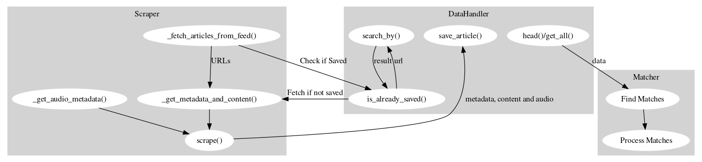

# KI-Projekt "Einfach Erklärt" Midterm Review
### KIP bei Herr Dr. Hußlein im SoSe 24
Lars Specht, Ben Reher, Simon Eiber und Felix Wippich, 07.05.24

## 1. Einleitung

Die Umsetzung eines Projekts ist oft von verschiedenen Herausforderungen geprägt, die von technischen Aspekten bis hin zu organisatorischen Belangen reichen. In diesem Projektbericht werden sowohl technische als auch organisatorische Herausforderungen beleuchtet, die während der Implementierung bewältigt wurden. Besonderes Augenmerk liegt dabei auf der Integration neuer Teammitglieder, der remote Durchführung von Meetings sowie der Kommunikation mit Nachrichtenquellen wie Deutschlandfunk und MDR. Zudem wird die Datenstruktur für die Speicherung und das Scraping erläutert sowie ein Ausblick auf den Matching-Prozess gegeben, der für die Nutzung des aufgebauten Datensatzes von zentraler Bedeutung ist. Zuletzt geben wir einen kleinen Ausblick auf den weiteren Verlauf des Projekts.

## 2. Allgemein
### 2.1. Projektmanagement
Im ersten Abschnitt des Projekts wurde eine solide Grundlage für die Datensammlungs- und Verarbeitungsinfrastruktur geschaffen. Simon und Lars entwickelten Scraper für aktuelle und historische Artikel von Deutschlandfunk und Nachrichtenleicht, um die Datenbasis zu etablieren. Parallel dazu implementierte Felix einen DataHandler, der für die Organisation und das Management der gesammelten Daten zuständig ist. Dieser kann auf Veränderungen in den URL-Strukturen reagieren, um sicherzustellen, dass alle Informationen korrekt abgeglichen und gespeichert werden. Des Weiteren wurde mit der Kommunikation mit verschiedenen Nachrichtenquellen begonnen, um eine weitergehende Datenversorgung zu ermöglichen.
### 2.2. Herausforderungen (Felix)
Neben technischen Herausforderungen in der Umsetzung des Projekts stellten sich auch einige zusätzliche organisatorische Herausforderungen.

Durch die nach dem Projektstart erfolgte Zuteilung eines Teammitglieds in das Team, war eine schnelle Kontaktaufnahme und Integration des neuen Teammitglieds notwendig. Dies erforderte eine schnelle Einarbeitung und Anpassung der Teamdynamik. In Folge sollten auch die (wöchentlichen) Meetings remote absolviert werden.

Trotz dieser zusätzlichen Schwierigkeiten wurden alle Herausforderungen bisher hervorragend bewältigt. Um die Ressourcen für alle Teammitglieder ständig bereit zu halten, war bereits ein Repository auf GitHub angelegt, dieses wurde um eine Datei `Meetings.md` zur Protokollierung der in den remote Meetings besprochenen Inhalte erweitert. Die Meetings wurden fest wöchentlich und zusätzlich nach Bedarf angesetzt und finden virtuell über Zoom statt, des Weiteren ist ein ständiger Kommunikationskanal zum Austausch über WhatsApp,  für kurzfristige Änderungen oder dringende Probleme, verfügbar. Neben der bekannten Herausforderung von Videokonferenzen, bietet Zoom die Chance, den Bildschirm für "Code-Reviews" und "Code-Vorstellungen" zu teilen.

### 2.3. Pipeline
## 2. Aktueller Stand 

### 2.1. Kommunikation mit Nachrichtenquellen

Die Kommunikation mit den Nachrichtenquellen gestaltete sich als ein Bestandteil unseres Projekts. Wir wandten uns an Deutschlandfunk und MDR, um Zugang zu ihren Nachrichteninhalten zu erhalten, da wir bereits bei Deutschlandfunk auf Schwierigkeiten beim Scrapen historischer Daten gestoßen sind und es als eine alternative Möglichkeit gesehen haben, dort direkt anzufragen. Es ist hier deutlich schwerer an die Daten zu kommen, da einerseits viel mehr publiziert wird im Vergleich zu Nachrichtenleicht und es keine einfach abrufbare API gibt. Über verschiedene Kanäle wie E-Mail, Instagram, TikTok und LinkedIn versuchten wir, Kontakt herzustellen. Nach diesen mehreren Versuchen erhielten wir zuerst eine Antwort auf TikTok, dass es an das Team von Nachrichtenleicht weitergeleitet wurde. Einen Tag später kam dann eine Antwort von Herrn Bertolaso, einem leitenden Nachrichtenredakteur bei Deutschlandfunk. Er leitete unsere Anfrage weiter an Frau Gnad, und wir befinden uns derzeit in der Warteposition, in der Hoffnung auf weitere Unterstützung. Nach einem Telefonat mit Frau Gnad stellte sich heraus, dass noch die Möglichkeit besteht tagesaktuelle Daten aus den Instagram Captions von Nachrichten Leicht zu scrapen. Desweiteren hat sie uns mit dem Archiv in Verbindung gesetzt. Die Mitarbeitenden werden sich da in den nächsten Tagen bei uns melden, ob uns geholfen werden kann. Da MDR als Quelle erst letzte Woche dazu kam, ist hier leider noch kein Erfolgserlebnis zu verzeichnen, da bis jetzt nur Antworten kamen, dass es an die zuständige Redaktion weitergeleitet wurde.
Wir erwogen auch eine Zusammenarbeit mit der anderen Gruppe, die das gleiche Projekt durchführt, nachdem sich in einem Gespräch mit Prof. Baumann herausstellte, dass es sinnvoll sein könnte, sich beim Scrapen die Arbeit zu teilen. Jedoch wurde unsere Anfrage abgelehnt, da die andere Gruppe befürchtete, dass eine Auslagerung des Webscrapings zu einem Verlust in der Bewertung führen könnte, da dies ja auch Teil der Aufgabenstellung ist und auch einen gewissen Teil des Arbeitsaufwandes darstellt.

## 2.2 Scraper

### 2.2.1. Was ist ein Scraper?

Ein Scraper ist ein Programm, das automatisch Daten von Webseiten extrahiert. Es gibt verschiedene Arten von Scrapern, die sich in ihrer Funktionsweise und ihren Anwendungsmöglichkeiten unterscheiden. Wir verwenden zwei Scraper-Bibliotheken: BeautifulSoup und Selenium. Diese unterscheiden sich in ihren Funktionen und Anwendungsbereichen.

### 2.2.2. BeautifulSoup

`BeautifulSoup` ist eine Bibliothek, die es ermöglicht, Daten aus HTML- und XML-Dateien zu extrahieren. Sie ist jedoch nicht in der Lage, Formulare zu bearbeiten oder JavaScript auszuführen, weshalb sie nur für statische Webseiten geeignet ist. Das bedeutet, dass sie lediglich den HTML-Code der Webseite auslesen kann und nicht die dynamischen Inhalte, die durch JavaScript generiert werden (zum Beispiel nach dem Drücken eines Buttons).

### 2.2.3. Selenium

`Selenium` ist ein Webdriver, der es ermöglicht, Webseiten zu steuern und mit ihnen zu interagieren. Ein Webdriver ist ein Programm, das die Steuerung eines Webbrowsers ermöglicht, also tatsächlich ein Browserfenster öffnet und dieses dann steuert. Selenium kann auch dynamische Webseiten auslesen, da es JavaScript ausführen kann. Warum wir Selenium nicht für alle Scraping-Aufgaben verwenden, ist, dass es langsamer ist als BeautifulSoup und auch mehr Rechenleistung benötigt (sowie wir noch herausfinden müssen, wie gut es funktioniert, das Ganze auf dem KI-Server mit GUI laufen zu lassen).

### 2.2.4. Was brauchen wir für Scraper für unser Projekt?

Für unser Projekt benötigen wir zwei Arten von Scrapern:

#### Historische Scraper

Mit historischen Scrapern sammeln wir Artikel, die in der Vergangenheit auf den Webseiten veröffentlicht wurden. Diese lassen wir einmalig laufen, um das Archiv der Webseiten zu erstellen.

#### Aktuelle Scraper

Die aktuellen Scrapern sind diejenigen, die wir regelmäßig laufen lassen, um kontinuierlich die neuesten Artikel von den Webseiten zu extrahieren.

### 2.2.5. Der `BaseScraper`

Für die Scraper haben wir eine Basisklasse `BaseScraper` erstellt, die die allgemeinen Funktionen und Methoden enthält, die für alle Scraper benötigt werden. Die Basisklasse enthält die folgenden Methoden:

- `base_metadata_dict()`: Gibt ein Dictionary zurück, das die Metadaten enthält, die wir für jeden Artikel speichern wollen (zum Beispiel Titel, Beschreibung, Datum, usw.).
- `_get_soup()`: Lädt die Webseite und gibt ein `BeautifulSoup` Objekt zurück.
- `_fetch_articles_from_feed()`: Extrahiert die Artikel-URLs aus dem Feed (oder auch anders, falls kein Feed verfügbar) der Webseite.
- `_get_metadata_and_content(url)`: Extrahiert die Metadaten und den Inhalt eines Artikels aus der URL.
- `scrape()`: Führt die einzelnen Schritte zum Scrapen der Webseite aus.

Dadurch müssen wir für jeden neuen Scraper nur noch die spezifischen Methoden implementieren, die für die jeweilige Webseite benötigt werden, und das Ganze ist ein wenig übersichtlicher.

## 2.3. MDR Scraper

### 2.3.1. Warum MDR?

Der MDR Scraper extrahiert Daten von der Webseite des Westdeutschen Rundfunks (MDR). Der MDR ist ein öffentlich-rechtlicher Rundfunksender, der für Sachsen, Sachsen-Anhalt und Thüringen schreibt. Der MDR bietet eine Vielzahl von Inhalten, darunter Nachrichten, Videos, Audios und mehr. Wir haben uns aus verschiedenen Gründen für den MDR als eine der Webseiten entschieden, von der wir Daten extrahieren wollen:

- Der MDR ist ein öffentlich-rechtlicher Sender, was eine gewisse Qualität der Daten sichert.
- Der MDR bietet eine Vielzahl von Inhalten.
- Die Nachrichten-Leicht Seite des MDR und die normalen MDR-Nachrichten sind unter einem Dach, was bedeutet, dass es zu jedem leichten Artikel auch einen normalen Artikel gibt.
- Die leichten Artikel verlinken immer direkt den normalen Artikel, weswegen wir hierfür keinen Matcher brauchen.
- Der MDR bietet Audios an, die von Menschen eingesprochen wurden.
- Der MDR lädt wöchentlich recht viele leichte Artikel hoch, was uns eine gute Datenbasis bietet (ca. 22 Artikel pro Woche).

### 2.3.2 Funktionsweise

Der MDR Scraper extrahiert zunächst Daten von der Nachrichten-Leicht Seite des MDR und lädt die Audios herunter. An die Audios zu kommen war nicht ganz einfach, da der MDR die Audios nicht direkt verlinkt, sondern sie über eine JavaScript-Datei lädt. Daher kann hierfür leider nicht `BeautifulSoup`, sondern `Selenium` muss verwendet werden. Da die einfachen Artikel immer auf die normalen Artikel verlinken, benötigen wir hierfür keinen Matcher. Im Anschluss an den einfachen Artikel wird der normale Artikel gescraped.

## 2.4 Deutschlandradio

Deutschlandradio ist ein integraler Bestandteil des öffentlich-rechtlichen Rundfunks und verantwortlich für die Produktion verschiedener Nachrichtenangebote, darunter Deutschlandfunk und Nachrichtenleicht, die als bedeutende Datenquellen dienen. Eigenständige Redaktionen sind dafür zuständig, die jeweiligen Inhalte zu konzipieren und zu veröffentlichen.
Deutschlandfunk

Die Gründe für die Berücksichtigung von Deutschlandradio sind vielfältig:

    Es ist Teil des öffentlich-rechtlichen Rundfunks.
    Seine Reichweite erstreckt sich über ganz Deutschland.
    Es bietet eine breite inhaltliche Abdeckung aktueller Themen, darunter Politik, Wirtschaft, Wissenschaft, Gesellschaft und Kultur.
    Es besteht eine redaktionelle Nähe zwischen Deutschlandfunk und Nachrichtenleicht.
    Die Inhalte werden von Menschen erstellt, sowohl in Form von Artikeln als auch von Audios.

#### Nachrichtenleicht

Auf der Internetseite von Nachrichtenleicht werden jeden Freitagnachmittag etwa 5-6 Artikel in leicht verständlicher Sprache veröffentlicht. Zusätzlich werden die Artikel häufig als Audio angeboten, wobei sie von menschlichen Sprechern eingesprochen werden.

#### Scraping

Dank der redaktionellen Nähe zwischen Deutschlandfunk und Nachrichtenleicht sind die Internetseiten größtenteils strukturell identisch aufgebaut. Dadurch konnte ein DeutschlandradioScraper basierend auf dem BaseScraper entwickelt werden, um Redundanzen zu vermeiden. Die Unterschiede liegen hauptsächlich in den Metadaten und der Verfügbarkeit von Audio bei Nachrichtenleicht-Artikeln. Ausgehend vom DeutschlandradioScraper konnten entsprechende Scraper für Deutschlandfunk und Nachrichtenleicht abgeleitet werden. Für den Nachrichtenleicht-Feed wurde eine API-Schnittstelle gefunden, die das Scrapen erleichtert.

## 2.5. Datenstruktur (Felix)
Auf Anraten von Professor Baumann wird für die Speicherung keine SQL-Datenbank benutzt sondern wie in der Abbildung dargestellt eine Ordnerstruktur.

```
|-- data
|   |-- deutschlandfunk
|   |   |-- easy
|   |   |   |-- 2024-03-15-Bundes-Wehr_beteiligt_sich_an_Luft
-Bruecke_fuer_den_Gaza-Streifen_
|   |   |   |   |-- audio.mp3
|   |   |   |   |-- content.txt
|   |   |   |   |-- metadata.json
|   |   |   |-- lookup_deutschlandfunk_easy.csv
|   |   |-- hard
|   |   |   |-- 2024-04-25-Angebliche_Drohnenangriffe_Belarus_
erhebt_Vorwuerfe_gegen_Litauen_-_Dementi_aus_Vilnius
|   |   |   |   |-- content.txt
|   |   |   |   |-- metadata.json
|   |   |   |-- lookup_deutschlandfunk_hard.csv
|   |   |-- matches_deutschlandfunk.csv
```
_Abbildung: Struktur des zur Speicherung genutzten Dateisystems am Beispiel von Deutschlandfunk (hard) und Nachrichten Leicht (easy) (reduziert auf jeweils einen Artikel)_

Für jede Nachrichtenquelle findet sich im `data` Verzeichnis ein Unterordner. Da das Matchen lediglich innerhalb derselben Quelle (also z.B. nur Deutschlandfunk zu Nachrichtenleicht, nicht DLF zu MDR) stattfinden soll, findet sich die Datei mit den jeweiligen Matches (`matches_<Nachrichtenquelle>.csv`) auf dieser Ebene (z.B. `deutschlandfunk`). Jedes der Unterverzeichnisse ist wiederrum aufgeteilt in die Ordner `easy` und `hard`, wobei easy die Nachrichten in leichter Sprache enthält und hard die Nachrichten in Standardsprache. Hier findet sich für jeden gespeicherten Artikel ein eigener Ordner mit der Benennungsstruktur `<Jahr>-<Monat>-<Tag>_<Titel>`. Im Ordner zum jeweiligen Artikel findet sich jeweils `content.txt`, der Haupttext des Artikels, `metadata.json`, der Verschiedene Metadaten wie URL, Autor und Datum in einem über alle Nachrichtenquellen standarisierten JSON- Format enthält, sowie `audio.mp3`, falls der Artikel als vorgelesene Version als Audio verfügbar ist.
 
Für eine effiziente Suche der Artikel nach ihren jeweiligen Links ist jeweils eine so genannte `lookup-<Nachrichtenquelle>-<easy oder hard>.csv` implementiert. In diesem wird für jeden gespeicherten Artikel jeweils der Dateipfad und der Link im CSV-Format abgespeichert. Die URL des Artikels wird auch in den Metadaten gespeichert, dennoch entstand die Idee des redundanten Speicherns um für die Suche nach der URL nicht über das ganze Verzeichnis iterieren, sondern lediglich eine CSV-Datei analysieren zu müssen. Besonders bei großen Datenmengen ist so eine bessere Effizienz erhofft. Leider standen für Tests zum Midterm Review noch keine großen Mengen an gescrapten Artikeln zur Verfügung, dennoch zeigte sich bereits bei wenigen gespeicherten Artikeln eine minimal bessere Effizienz in der Suche nach der URL (über den Lookuptable), gegen eine Suche nach dem Titel desselben Artikels (über Iteration über das Verzeichnis).

```python
'''Getestet wurde die Suche über den Link des Artikels 
sowie den Titel. Die Funktion sucht bei der url automatisch 
im Lookuptable ansonsten iteriert sie über das Unterverzeichnis. 
Das erste Argument e steht dafür, dass das easy Unterverzeichnis 
durchsucht werden soll''' 
dh.search_by("e", "url", "https://www.deutschlandfunk.de/ \
zahl-der-arbeitslosen-sinkt-im-april-um-20-102.html")
dh.search_by("e", "title", "Zahl der Arbeitslosen sinkt \
im April um 20.000")
# Output
"Time taken for search_by url: 0.0020 seconds"
"Time taken for search_by title: 0.0071 seconds"
```

Die Speicherung im eigenen Format bietet viel Flexibilität und Unabhängigkeit von Versionen eines Datenbankmanagementsystems. Allerdings stellt sich die Herausforderung eines komfortablen, einheitlichen und effizienten Zugriffs auf die Daten. Hierfür wurde im Projekt die Klasse `DataHandler` definiert. Diese bietet ein Interface für den **Zugriff** auf die Daten durch Funktionen wie `head`, welcher die ersten n Artikel als Pandas DataFrame zurück gibt. Des Weiteren soll eine einheitliche **Speicherung** durch vordefinierte Speicherfunktionen sichergestellt werden. Auch ermöglicht der DataHandler eine **Suche** im Verzeichnis nach Metadaten. Um keine Artikel doppelt zu Scrapen gibt es außerdem die Funktion `is_already_saved`, welche sich die bessere Sucheffizenz der Lookuptable zunutze macht. Sie gibt zurück, ob die URL bereits gescraped und gesaved wurde. Das DataHandler Objekt muss mit der jeweiligen Nachrichtenquelle initialisiert werden (aktuell `“dlf“`, oder `“mdr“`) und kann dann für das jeweilige Unterverzeichnis genutzt werden. Die Initialisierung mit der Nachrichtenquelle soll unter anderem einer Vermischung der Daten vorbeugen. Den meisten Funktionen muss übergeben werden, ob im `“hard“` (`“h“`), oder `“easy“` (`“e“`) Unterverzeichnis gelesen oder geschrieben werden soll.

## 2.6 Weitere Nachrichtenangebote

Zur Auswahl standen auch die Nachrichtenangebote der APA (Austria Presse Agentur), des NDR und des SR. Die APA bietet Nachrichten in leichter Sprache an, die von capito.ai generiert werden, einem vollautomatisierten KI-Tool zur Übersetzung von Texten aus der Standardsprache in leicht verständliche Sprache. Auf ihrer Website sind die Originalartikel sowie Übersetzungen in die Sprachniveaus B1 und A2 verfügbar. Wir haben uns gegen die Verwendung der APA als Datenquelle entschieden, da keine Audioversionen der Artikel vorhanden sind und die Artikel in leichter Sprache ausschließlich von KI generiert werden, was zu einem möglichen Bias in den Daten führen könnte. Darüber hinaus erreichen die Artikel nicht die qualitative Standards der öffentlich-rechtlichen Sender. Sowohl der NDR als auch der SR sind Mitglieder des öffentlich-rechtlichen Rundfunkverbunds ARD und bieten ebenfalls Nachrichten in leichter Sprache mit Audio an. Allerdings unterscheiden sich die Texte in leichter Sprache formell stark von denen des Deutschlandradios und des MDRs. Zudem gibt es keinen separaten Nachrichtenfeed, was das Scrapen der Artikel erschwert. Das Angebot des SR in leichter Sprache konzentriert sich hauptsächlich auf regionale Nachrichten aus dem Saarland. Aus diesen Gründen haben wir vorläufig beschlossen, diese Nachrichtenangebote nicht zu berücksichtigen.

### 2.7. KI-Server

Die Datenspeicherung und das Scraping (später auch das Matching der Artikel) finden über den KI-Server der OTH statt. Dies war von Anfang an die Idee, da dieser eine hohe Rechenleistung bietet und somit das Scraping und unsere kommenden Schritte (siehe [Ausblick](#ausblick)) schneller und effizienter gestaltet. Seit kurzem existiert auich die Ordnerstruktur und die Daten werden automatisiert gespeichert. 

Mithilfe eines Cronjobs werden die Scraping-Skripte regelmäßig ausgeführt, um die neuesten Artikel zu speichern. Wie bereits erwähnt, veröffentlicht Nachrichtenleicht wöchentlich neue Artikel und Deutschlandfunk, sowie MDR, täglich. Demnach wird es zwei Skripte geben. Eines, das einmal am Tag ausgeführt wird und die neuen Artikel von Nachrichtenleicht speichert und eines, das alle zwei Stunden ausgeführt wird und die neuen Artikel von Deutschlandfunk und MDR speichert oder aktualisiert. Sollten wir mit diesen noch experimentellen Zeiträumen für die Ausführung der Skripte auf Probleme stoßen, werden wir diese gerade am Anfang der Scraping-Phase natürlich auch noch anpassen.


## 3. Ausblick
### 3.1. Base Matcher (Felix)
Für die Matcher die eignen Python Code benötigen, ist ein ähnlich modularer Aufbau geplant wie bei den Scrapern. Dies erfüllt vor allem den Zweck die Module übersichtlich zu halten und redundanten Code zu vermeiden. Ziel ist es Fähigkeiten, die jeder Matcher benötigt im `BaseMatcher` zu bündeln und zu vereinheitlichen. Zum aktuellen Zeitpunkt enthält der `BaseMatcher` die Funktionalität zum Schreiben in das Matching File `matches_<Nachrichtenquelle>.csv`. 

### 3.2. Simple Matcher (Felix)
Wie im Späteren beschrieben, sollen zum Matchen auch aufwendigere Methoden (z.B. LLMs) zum Einsatz kommen. Dies ist allerdings nicht immer erforderlich und teilweise lassen sich Matches auch ganz trivial ermitteln. So stellt beispielweise MDR zum jeweiligen Artikel in leichter Sprache einen Link zum Artikel in normaler Sprache zur Verfügung. Der `SimpleMatcher` bündelt diese trivialen Arten des Matchens, beispielsweise über eine Funktion, der man bereits die zusammengehörenden URLs übergibt und dieser die passenden Dateipfade in das Matchingfile schreibt.   

### 3.3. Matching

Wir haben einige grundlegende Recherchen zu verschiedenen Matching-Methoden durchgeführt, die wir in den nächsten Wochen weiter vertiefen möchten. Einzelne Ideen, die wir ausbauen und erweitern wollen, sind:

#### Hugging Face

Ein hilfreiches Element dabei ist die Plattform Hugging Face, die eine große Bibliothek von Pre-Training-Models für unter anderem NLP-Aufgaben bietet. Diese Modelle sind nicht nur leistungsstark, sondern auch anpassungsfähig, was uns die Möglichkeit gibt, sie auf unsere spezifischen Anforderungen zuzuschneiden oder Teile davon als Inspiration zu verwenden. Es gibt dort Modelle zu den verschiedensten Arten der Textanalyse, womit durch einiges Experimentieren mit den Modellen viel gewonnen werden kann.

#### Named Entity Recognition

Ein vielversprechender Ansatz, den wir in Betracht ziehen, ist die Named Entity Recognition (NER). NER ist eine Technik, die wir bei unseren Recherchen gefunden haben und nutzen möchten. Diese ermöglicht es uns, aus Texten spezifische Informationen wie Namen von Personen, Organisationen oder Orte zu extrahieren. Diese Identifikation und Klassifikation von Entitäten ist für das Matching von entscheidender Bedeutung, da sie es uns erlaubt, bei gleichen Ergebnissen möglichen Textpaares zu erstellen. Auf Huggingface kann man einige Modelle direkt in der Webseite testen, hierbei konnten wir bei kurzen Tests schon vielversprechende Ergebnisse erzielen. Wir planen, die NER-Modelle so zu trainieren, dass diese speziell auf unseren Datensatz zugeschnitten sind, um die bestmögliche Leistung zu erzielen.

#### BERT

Wir planen auch, das leistungsstarke Modell BERT (Bidirectional Encoder Representations from Transformers) zu nutzen, um die Themenähnlichkeit zwischen zwei Texten zu ermitteln. BERT basiert auf einer speziellen Variante der Transformer-Architektur und ermöglicht eine Analyse von Texten. Dies erlaubt eine präzisere Erfassung des Kontexts eines Wortes oder einer Wortgruppe in einem Satz. Im Hinblick auf die Semantik können wir damit Übereinstimmungen feststellen und herausfinden, ob zwei Texte das gleiche Thema behandeln.

Allgemein könnte es hilfreich sein, einen Datensatz mit gelabelten Beispielen zu haben, um das Modell zu trainieren und zu validieren. Diesen werden wir voraussichtlich in kleinem Maße händisch erstellen und je nach Bedarf erweitern. Im Idealfall wird uns dieser Ansatz ermöglichen, eine präzise und effiziente Methode zur Themenidentifikation in Texten zu implementieren.

## Fazit


